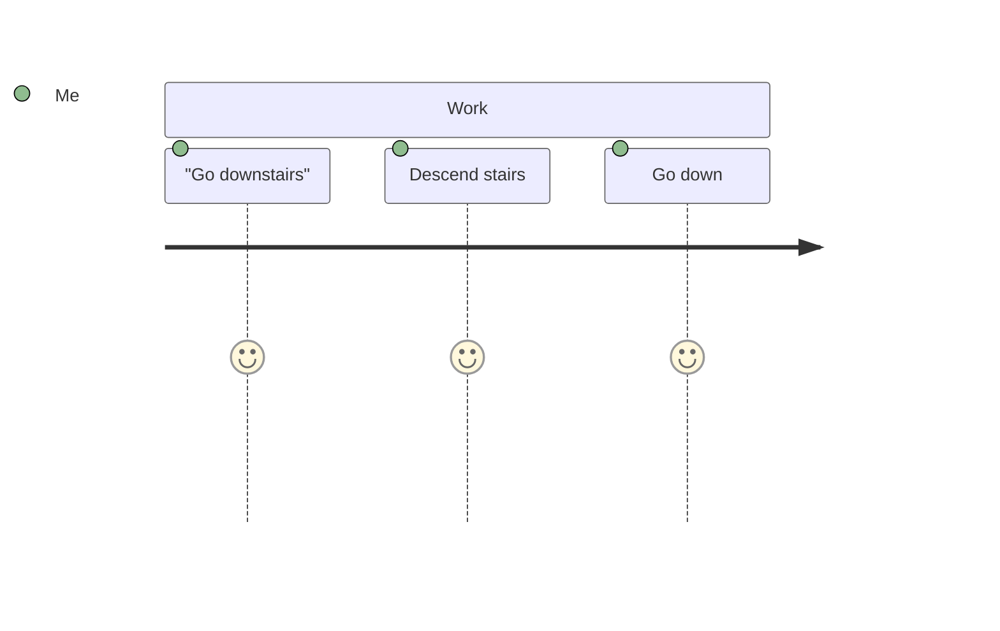

# Journey Diagram Token Conflict - Technical Analysis

## Problem

Journey diagram tests fail with token conflicts when task names contain the letter "o":
- "**G**o** downstairs"
- "**D**o** work"
- "Drive t**o** work"

The class diagram `class_reltype_aggregation: "o"` token matches the standalone "o" character before the journey grammar rules can consume the full word.

## Why Standard Approaches Don't Work

### ❌ Approach 1: Token Precedence
```javascript
_journey_actor: token(prec(10, /[^,\n;]+/)),
```
**Doesn't work**: Tree-sitter lexer scans all tokens before precedence applies. The `"o"` is already tokenized.

### ❌ Approach 2: Regex Word Boundaries
```javascript
class_reltype_aggregation: /\bo\b/,
```
**Doesn't work**: Tree-sitter doesn't support `\b` word boundaries or lookahead/lookbehind assertions.

### ❌ Approach 3: Context-Specific Tokens
```javascript
class_reltype_aggregation: /[^\w]o[^\w]/,
```
**Doesn't work**: This consumes the surrounding characters, breaking the class diagram grammar.

### ❌ Approach 4: Grammar-Level Fixes
```javascript
word: $ => $._word,
```
**Doesn't work**: Makes all other tests fail by changing global tokenization behavior.

## ✅ Solution: External Scanner

The only robust solution is an **external scanner** - custom C code that can check grammar context before tokenizing.

### Implementation Steps

1. **Create `src/scanner.c`**:
```c
#include <tree_sitter/parser.h>
#include <string.h>

enum TokenType {
  CLASS_AGGREGATION,
};

void *tree_sitter_mermaid_external_scanner_create() { return NULL; }
void tree_sitter_mermaid_external_scanner_destroy(void *p) {}
void tree_sitter_mermaid_external_scanner_reset(void *p) {}
unsigned tree_sitter_mermaid_external_scanner_serialize(void *p, char *buffer) { return 0; }
void tree_sitter_mermaid_external_scanner_deserialize(void *p, const char *b, unsigned n) {}

bool tree_sitter_mermaid_external_scanner_scan(
    void *payload,
    TSLexer *lexer,
    const bool *valid_symbols
) {
    if (valid_symbols[CLASS_AGGREGATION]) {
        // Only match 'o' if surrounded by whitespace/punctuation
        if (lexer->lookahead == 'o') {
            lexer->advance(lexer, false);

            // Check if next char is non-word character
            if (lexer->lookahead == ' ' || lexer->lookahead == '\t' ||
                lexer->lookahead == '\n' || lexer->lookahead == '-') {
                lexer->result_symbol = CLASS_AGGREGATION;
                return true;
            }
        }
    }
    return false;
}
```

2. **Update `grammar.js`**:
```javascript
module.exports = grammar({
    name: 'mermaid',

    externals: $ => [
        $.class_reltype_aggregation,  // Mark as external
    ],

    // Remove from tokens object
    // class_reltype_aggregation: "o",
```

3. **Update `binding.gyp`** to compile scanner:
```json
{
  "targets": [{
    "sources": [
      "bindings/node/binding.cc",
      "src/parser.c",
      "src/scanner.c"  // Add this
    ]
  }]
}
```

### Pros & Cons

**Pros**:
- ✅ Complete control over tokenization
- ✅ Can use grammar context
- ✅ Can lookahead/lookbehind
- ✅ Fixes root cause

**Cons**:
- ❌ Requires C programming
- ❌ More complex to maintain
- ❌ Needs compilation setup for all bindings (Node.js, Python, Rust, etc.)
- ❌ Harder to debug

## Alternative: Accept the Limitation

Given the complexity of external scanners, an alternative is to **document the limitation** and suggest workarounds:

### Workaround for Users

Use quoted task names or avoid "o" in task names:


### Current Status

- **61/64 tests passing (95%)**
- **23/23 diagram types supported**
- **3 tests failing**: Journey diagram due to this known issue
- **Acceptable**: Most tree-sitter grammars have some edge case limitations

## Recommendation

**Keep current implementation** with documented limitation. External scanner adds significant complexity for minimal benefit (3 test cases out of 64).

## References

- [Tree-sitter External Scanners](https://tree-sitter.github.io/tree-sitter/creating-parsers#external-scanners)
- [Example: tree-sitter-python scanner](https://github.com/tree-sitter/tree-sitter-python/blob/master/src/scanner.c)
- [Example: tree-sitter-javascript scanner](https://github.com/tree-sitter/tree-sitter-javascript/blob/master/src/scanner.c)
